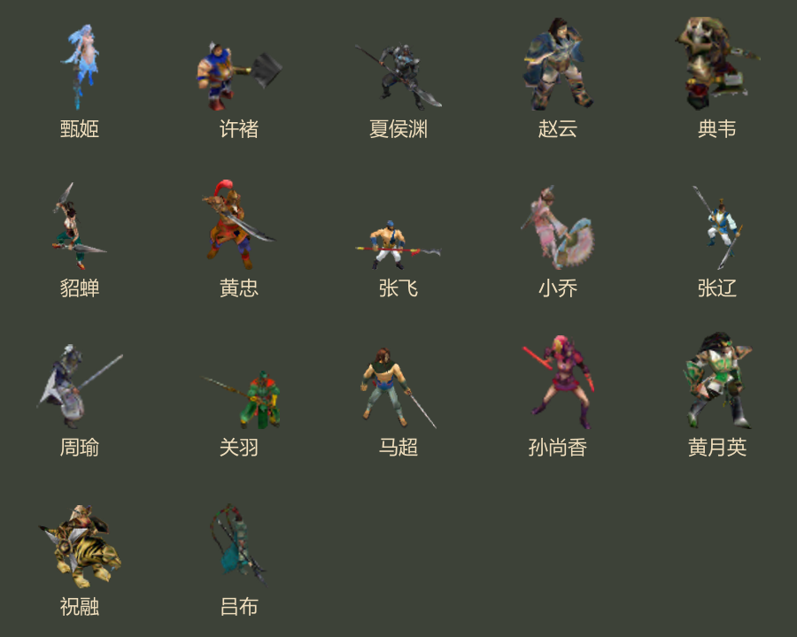
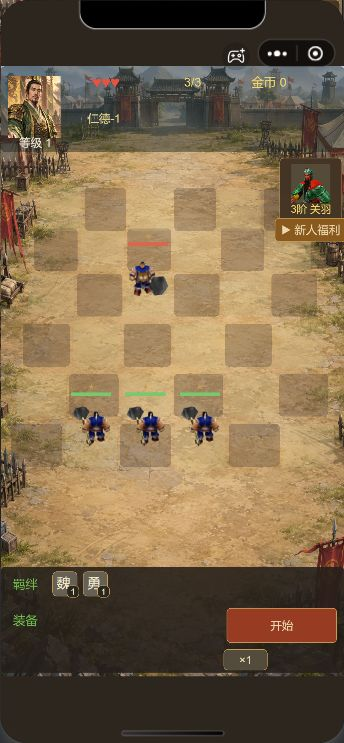
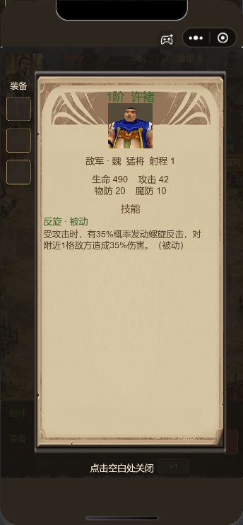
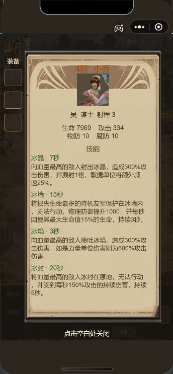
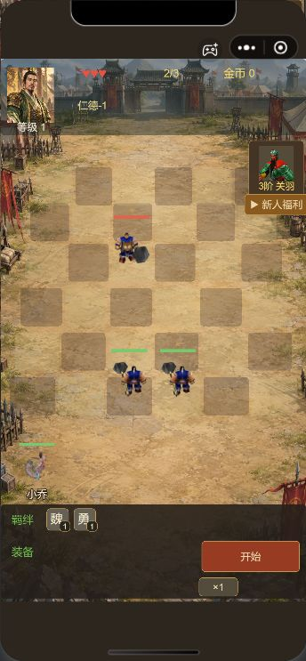
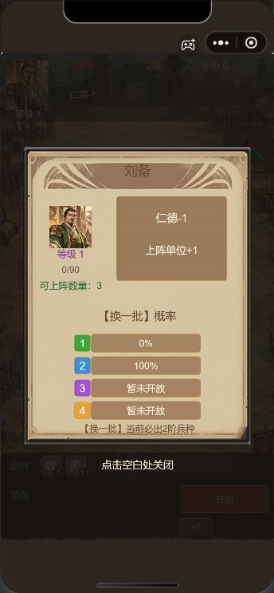
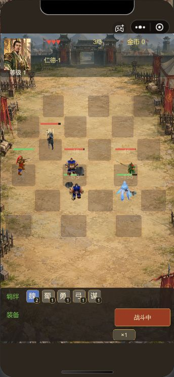

# 战场模型与交互修正

微信开发者工具仍导入仓库的 `game` 目录。本轮不执行微信上传。

## 已完成

- 新远征刘备默认人口3、自动上阵3名许褚；首胜后等级2、人口4，之后沿现有经验规则增长，最多6。旧存档阵位不重排。切换人口较少的主公时，仅将超额单位移回备战席。
- 敌方及己方普通单位直接点击查看只读属性；四个技能完整显示在一页。属性面板没有合成、下阵、遣返按钮。满足三合一条件时保留原有点击合成入口，合成预览不属于属性页。
- 主公栏透明，无地图按钮；备战席去掉面板和人数条，保留人物、描边姓名及必要翻页箭头。修复拖出单位原触摸区域后松手不能布阵的问题。
- 17名武将使用其对应MDX原始骨骼动作导出的多方向动画；五套方向加左右镜像形成八向。具备待机、移动、普攻、施法、死亡动作。按可见像素校准脚底与占格尺寸，全帧预检避免画面边缘裁切。法系使用光点，物理远程使用箭矢。
- 太史慈、甘宁、张角、颜良按用户确认保留头像，并显示“模型待制作”。诸葛亮保留旧资源兼容。

## 实现边界

这是原MDX动作烘焙后的透明Spine附件动画，运行时不直接加载MDX三维骨骼。左右镜像会同时镜像武器持握方向。它比单张头像有完整动作和朝向，但不能等同实时3D模型。

普攻距离读取各武将各阶原配置，不按职业统一猜测；近战先寻路进入射程。战斗时间轴和伤害规则继续使用现有本地模拟器。动画按配置的接触比例匹配命中前摇，未声称逐毫秒复原原版动作时序。此前尚未完整恢复的次级技能、原服随机算法仍属已有边界。

本轮没有增加兵种、奖励、属性页操作或战斗功能。默认人口和自动上阵是用户本轮明确要求的修正。没有改写真实玩家存档。

## 配置与职责

- `game/play/battle-appearance.js`：模型资源映射、待制作名单、朝向和投射物外观。
- `game/play/model-animation.js`：方向选择、镜像、动画时序；不计算伤害。
- `game/play/unit-details.js`：只读属性查询和单页视图，共用 `prepareBattle` 的属性计算。
- `game/play/battle-hud-config.js`：透明栏、备战席和属性页布局。
- `game/play/expedition-config.js`：初始阵位及基础人口。
- [模型来源清单](model-sources.json)：17套源模型、源地图、动作名称、体积和4名待制作角色。逐文件来源哈希在各模型的 `battle-*-manifest.json` 中。

图集启动时按角色懒加载；去除透明边缘后，17套动画纹理文件合计约6.32MiB，全部解码纹理约101.13MiB（不含引擎、其他资源与运行时开销）。微信真机包体和性能需另行验证。

## 验证

- 现有52项回归及6项新增检查，共58项通过。包括所有21名武将各阶技能完整性、敌我属性与开战快照一致、普攻射程、八向映射、模型完整性、新局人口和切换主公。
- 开发者工具成功解析17套模型，每套25个方向动作；透明模式正常，图集无白底、全帧边界检查通过。
- 实际触摸敌方打开属性，点击面板内部保持打开，点击外部关闭；四技能小乔完整单页展示。
- 混合阵容实际播放记录74个动作事件，包含近战32次、物理远程23次、法系远程4次出手、移动和3次死亡，朝向与动作正常切换。记录见 [运行时动作记录](runtime-trace.json)。
- 验收使用纯内存夹具，恢复时比较真实存档序列化值一致；未覆盖微信真机验收。

## 截图















## 复现

```powershell
node tools/render-battle-models.cjs
node tools/compact-battle-atlases.cjs
node tools/battle-model-report.cjs
node --test tools/test-local.cjs tools/test-balance.cjs tools/test-chapter-loop.cjs tools/test-classic.cjs tools/test-handbook.cjs tools/test-portraits.cjs tools/test-expedition.cjs tools/test-battle-hud.cjs tools/test-battle-refinement.cjs
```

渲染工具只读原素材目录，需要本机已有的模型查看器、Chrome和sharp。验收入口 `tools/battle-refinement-qa.cjs` 的 `setup` 建立内存局，`restore` 恢复真实界面。

后续架构优化建议：从已审定的模型来源清单生成运行时资源注册表，将身份、动画必需项、尺寸和包体检查纳入同一构建步骤，减少手工名单漂移；移动设备再按实测内存加入模型缓存淘汰。当前先保持外观、只读属性和战斗结算职责分离。
