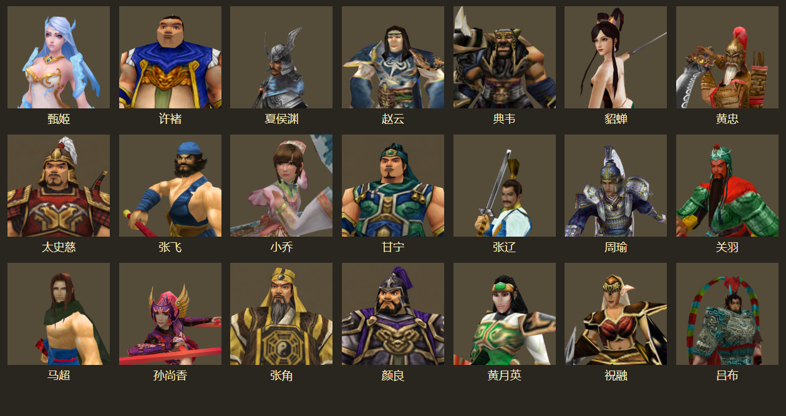
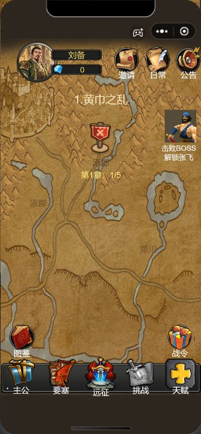
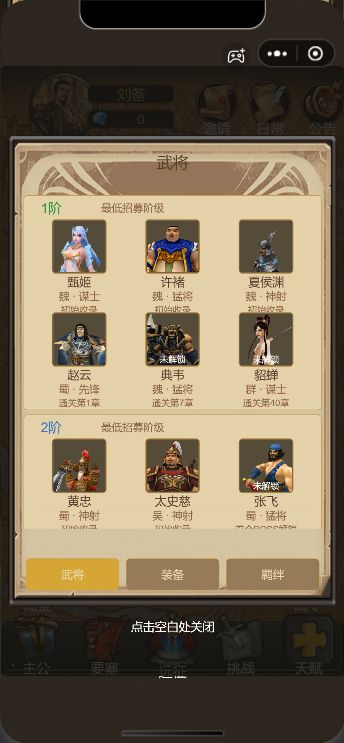
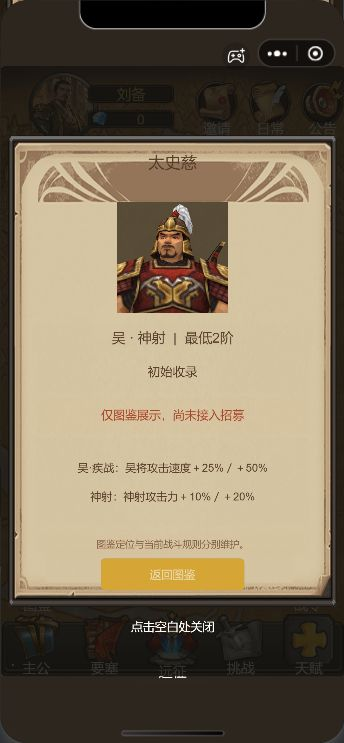
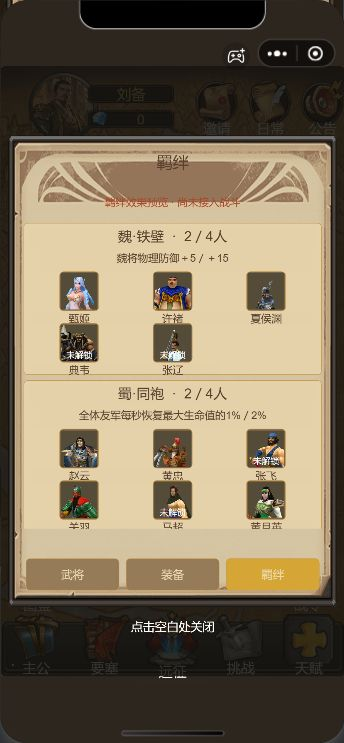
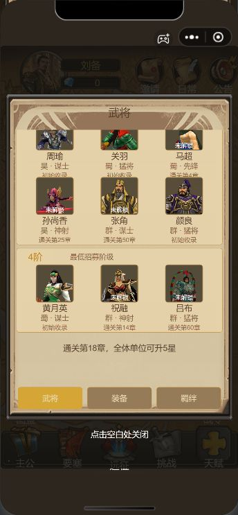
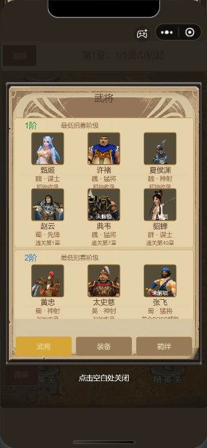

# 21名武将卡通头像验收

本轮仅替换静态头像，供确认外观。17人从素材库模型渲染，4人为同风格外观方案。未修改战斗模型、动画、特效、人物数值、解锁条件或存档；未执行微信上传。



## 来源与边界

- 模型渲染：甄姬、许褚、夏侯渊、赵云、典韦、貂蝉、黄忠、张飞、小乔、张辽、周瑜、关羽、马超、孙尚香、黄月英、祝融、吕布。
- **外观方案，模型待制作**：太史慈、甘宁、张角、颜良。使用内置 imagegen，以实际模型静帧作为风格参考；没有新建或导入这四人的战斗模型。
- 周瑜的候选文件名为 `ZhouYu.mdx`，原地图用作陆逊；小乔使用多人共享的 `q2.mdx` 候选。本轮为头像试选，不把文件名或地图名称当作身份验收结论。
- 夏侯渊、黄忠等候选的原武器与当前职业未必对应；本轮只确认头像，后续模型阶段仍需逐人检查武器、动作与技能表现。
- 七位主公及战斗中的诸葛亮沿用原素材。新增图鉴人物仍不能由图鉴招募。

## 配置与复用

- `game/play/portrait-config.js`：21人资源路径、制作类别、待制作模型标记及统一尺寸。
- `game/play/portraits.js`：只读查询及旧头像路径兼容；图鉴和首页张飞提示最终加载同一张纹理。
- `source-assets/portrait-manifest.json`：每张图片摘要、模型与贴图来源摘要、静帧动作时刻、镜头和裁切参数，或生成提示词。
- `source-assets/portrait-concepts.json`：四张生成头像的完整提示词、参考图及本机原始输出路径。
- `tools/portrait-sources.cjs`：模型候选与镜头配置。以独立地图资源根查找贴图，避免同名贴图串用。

头像均为包内512×512 PNG。构建或运行游戏不依赖模型库、生成工具或原CDN。复现模型静帧使用 `node tools/render-portraits.cjs`，安装使用 `node tools/install-portraits.cjs`；生成源图片和渲染依赖需要本机已准备。浏览器可通过 `PORTRAIT_BROWSER` 覆盖。

## 验证结果

- 原有29项领域测试、新增3项头像校验通过；另跑2个既有战斗模拟脚本，Node测试输出总计34项通过。
- 开发者工具实际解码21张512×512头像；首页张飞旧路径与图鉴新路径返回同一纹理。
- 首页与章节地图入口、武将详情与返回、羁绊页签、装备占位页、真实触摸滚动、弹窗外关闭均已检查。
- 武将滚动偏移555.69进入详情再返回保持不变，可继续滚至1039；地图偏移-410打开与关闭图鉴保持不变。
- 局内与局外数据序列化前后完全一致，未改变金币、阵容、解锁或待领取战果。开发者工具运行时拒绝记录为空。
- 本轮开发者工具截图见下方；手机实机效果尚未验收。

测试命令：

```powershell
node --test tools/test-local.cjs tools/test-balance.cjs tools/test-chapter-loop.cjs tools/test-classic.cjs tools/test-handbook.cjs tools/test-portraits.cjs
```

| 首页 | 武将 | 详情 |
|---|---|---|
|  |  |  |

| 羁绊 | 滚动到底 | 地图入口 |
|---|---|---|
|  |  |  |

后续架构建议：保留独立的头像映射，待外观确认后再以同一人物ID关联模型、动画和特效配置；不要将图鉴21人配置直接写入现有五人战斗名册。
