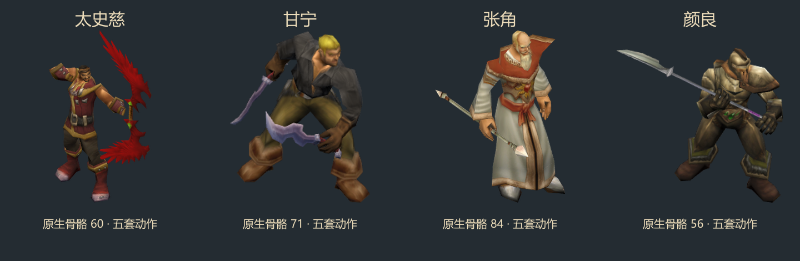

# 魔兽资源版：太史慈、甘宁、张角、颜良

已替换上一版程序化低多边形方案。当前四位使用 `F:/WoW-Assets/classic-titan/raw` 内的人物、原始 BLP 贴图和武器，保留源模型蒙皮权重及真实骨骼动作。头像同步为相同模型的实拍，英雄 ID、属性、技能规则和玩家存档未改变。



| 英雄 | 人物来源 | 武器 | 骨骼 | 烘焙帧数 |
| --- | --- | --- | ---: | ---: |
| 太史慈 | humanmalewarriorlight | blood_c_01 弓 | 60 | 360 |
| 甘宁 | humanmalepirateswashbuckler | 两把 horde_a_02 单手刀 | 71 | 360 |
| 张角 | humanmalecaster | jeweled_b_01 法杖 | 84 | 420 |
| 颜良 | humanmalewarriorheavy | bladed_b_01 长柄武器 | 56 | 360 |

完整路径、贴图和动作编号在 `tools/wow-models.config.json`；资源大小和模型摘要汇总在 [sources.json](sources.json)。这是魔兽美术资源适配的三国英雄外观，保留了原素材的人脸、服装和武器造型。

## 动作与游戏接入

每位提供待机、移动、普攻、技能和死亡五套动作；五个独立视角加三个运行时镜像视角，共 25 条动画，继续使用游戏原有 Cocos Spine 附件动画加载器。武器绑定 M2 原生手部附件点，随蒙皮骨架同步运动。

烘焙器从动画所有采样帧计算镜头，再对图集进行透明边缘压紧。人物身份、贴图、武器缩放与朝向、动作编号、烘焙帧率和镜头参数均集中配置。游戏运行时不依赖魔兽客户端、资源预览网页或本机外部目录。

`source-assets/wow-models/` 保留解析后的 JSON、贴图和带五套蒙皮动画的 GLB，可继续导入三维工具精修。旧版原创 GLB 留在 `source-assets/authored-models/`，不再用于这四位的战场外观。

## 可重复构建

在 `tools/wow-models.config.json` 中配置实际资源根目录、现有只读解析器、Three.js、Puppeteer 和浏览器位置。初次导出需要 Python/Pillow；从已经导出的工程资源重新烘焙时不需要再次读取原始资源库。

```powershell
python tools/export-wow-models.py
node tools/render-wow-models.cjs
node tools/compact-battle-atlases.cjs
node tools/calibrate-body-centers.cjs
node tools/install-portraits.cjs taishici ganning zhangjiao yanliang
node tools/wow-models-report.cjs
node tools/battle-model-report.cjs
node tools/build-wechat.cjs
```

两个导出/渲染命令均可在末尾指定英雄 ID；渲染命令加 `--preview` 仅生成审阅图，不覆盖游戏资源。此解析路径面向本次选定的内嵌动作 M2；遇到外置 SKEL、缺失纹理、动画数据越界或未支持的插值时会停止，不能当作全版本 M2 转换器使用。

## 本轮验证结果

- 四套源模型、武器、SKIN 和 BLP 依赖均记录实际读取文件的 SHA-256，核验原资源未被改写。
- GLB 包含真实蒙皮、关节权重和五套动画；逐顶点检查权重与骨骼索引有效。
- 五种动作均验证实际顶点形变，共 1500 帧；最终图集边界裁切帧数为 0。
- 21 项相关测试通过，覆盖源资源、蒙皮、动作时长/帧率、头像摘要、模型覆盖、布局、战斗 HUD 和构建筛选。
- 微信开发者工具成功加载四位，并逐一创建播放全部 100 条方向动作。实际展示截图位于 `evidence/wow-models-runtime.jpg`，分步检查结果位于 `evidence/wow-models/runtime-*.json`。
- 异步加载改为后台启动、后续查询，避免上一轮长 Promise 复验超时。临时展示层已移除，前后玩家状态一致。
- `dist/wechat` 构建成功：29,625,569 字节（约 28.3 MiB），主包 2,236,298 字节。资源包根据运行时模型注册表排除 24 个已停用的旧模型文件，仍保留诸葛亮所需的旧模型和所有共享贴图。源目录文件不删除。
- 尚未手机实测，也未执行微信上传、审核或正式发布。

## 架构改进与下一步

本轮把发布资源筛选抽为独立策略，由运行时模型注册表决定需要保留的文件，避免新美术接入后继续打包整套废弃模型。源依赖、解析数据、烘焙图集和运行时资源四层分开，替换人物或武器不必改动战斗逻辑。

下一步可把英雄身份、头像来源、模型适配器和动作映射统一到一个资产注册表，再由它生成运行时配置、资源清单和验证输入。这样能减少多个文件重复登记英雄身份，也便于逐步替换其余模型。手机性能验收宜优先关注多位不同武将同屏时的纹理内存峰值，而不是只看压缩包体。

## 格式参考

二进制字段和压缩四元数解析参考本地已有的格式读取器及 MIT 项目 [wow.export M2Loader](https://github.com/Kruithne/wow.export/blob/main/src/js/3D/loaders/M2Loader.js)、[M2Generics](https://github.com/Kruithne/wow.export/blob/main/src/js/3D/loaders/M2Generics.js)、[AnimMapper](https://github.com/Kruithne/wow.export/blob/main/src/js/3D/AnimMapper.js)。源游戏美术与格式解析代码分别记录，不将魔兽美术标注为本项目原创。
