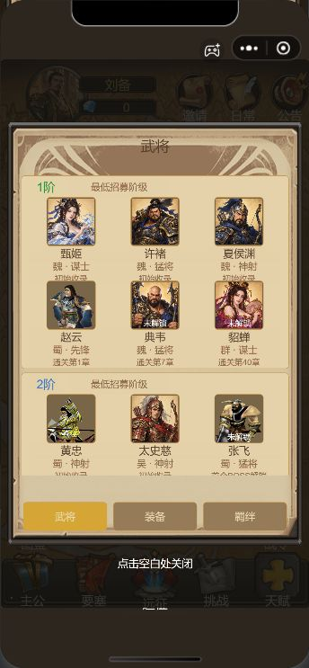
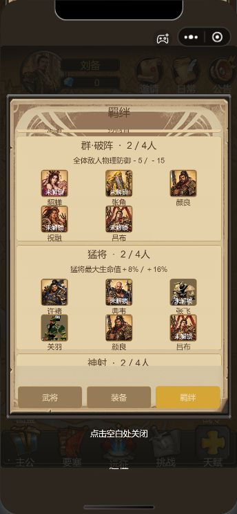
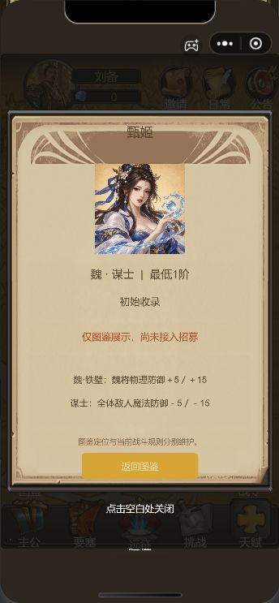

# 三国图鉴：武将与羁绊

图鉴包含21名武将，其中女性6名；不包含七位主公，也不将现有战斗名册中的诸葛亮额外加入本次图鉴。实际战斗名册、开局阵容、装备、存档及奖励规则不变。

## 操作

首页和章节地图的“图鉴”按钮打开同一羊皮面板弹窗。武将按最低阶分组，向上滑动查看更多；点头像查看阵营、职业、条件及当前接入状态，返回后保留列表位置。羁绊页展示四个阵营与四个职业的效果预览。装备页仅显示“装备图鉴暂未开放”。点弹窗外关闭，回到原页面及地图位置。

新增人物尚未加入实际招募或战斗；详情明确标注当前接入状态。章节条件表示图鉴设计条件，并不授予角色。已有玩家持有赵云时，不因图鉴规划的第1章条件而失去角色。张飞的状态读取现有BOSS结算解锁结果。

## 配置与边界

- `game/play/handbook-config.js`：唯一人物表、原兵种ID、阵营、职业、最低阶、条件、头像、羁绊数值及布局参数。
- `game/play/handbook.js`：只读查询与不同身份计数，从人物表派生成员，不访问存档写接口。
- `game/play/handbook-view.js`：弹窗、分页签、滚动及详情。宿主页面无需重建，避免地图位置和玩家状态受到影响。

羁绊效果为确认方案的预览，尚未接入战斗。全部按2／4名不同武将统计；同名不同阶只计一次，主公及未知身份不参与。

四个现有对应头像继续复用；其余17个头像由内置imagegen工具生成，放在 `game/skin-assets/handbook/`，提示词和来源记录见 `source-assets/handbook-portraits.json`。不新增战斗模型，不依赖CDN。

四个复用人物实际读取原模型立绘，以配置指定的头肩区域生成界面SpriteFrame；原图片和战斗外观均不改写。

## 验收入口

运行 `node --test tools/test-local.cjs tools/test-classic.cjs tools/test-handbook.cjs`。截图与模拟器状态证据保存在本机 `evidence/handbook-*`；该目录不随Git提交。开发者工具页面验收与手机验收分别记录，不把模拟器通过视为真机验证。

本轮29项测试通过。开发者工具实际点击验证首页及地图入口、人物详情、详情返回保留列表位置、两类列表滚动、装备提示、点击空白关闭。地图验收偏移在打开及关闭后均为-410；整组交互前后玩家状态序列化结果一致。真实页面截图随仓库保存在 `docs/handbook/`。

## 后续架构建议

正式接入21人战斗前，应建立以武将身份ID连接图鉴、招募、资源和战斗规则的适配器；保留图鉴与战斗数据分离，并显式声明可用能力。届时再迁移解锁条件与存档，避免仅修改图鉴文字就无意改变旧玩家阵容。
